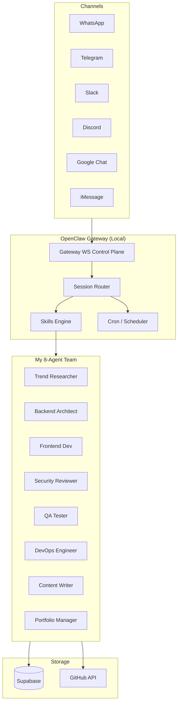

# 🦞 AI-Agent-OpenClaw

<p align="center">
  
</p>

<p align="center">
  <a href="https://github.com/openclaw/openclaw"></a>
  <a href="LICENSE"></a>
  <a href="https://ai-agent-openclaw.vercel.app"></a>
  <a href="https://github.com/mk-knight23/AI-Agent-OpenClaw/actions"></a>
</p>

> **My Full-Stack AI Agent Headquarters.** Everything OpenClaw can do, built for my workflow.

🌐 **[Live Website](https://ai-agent-openclaw.vercel.app)** · 📖 **[Docs](https://docs.openclaw.ai)** · 🚀 **[Quick Start](#quick-start)**

---

## 🦞 Overview
**OpenClaw** is the flagship of the ecosystem. It is a full-stack AI assistant headquarters designed for deep integration across all your digital touchpoints. It orchestrates complex 8-agent teams and manages a portfolio of 60+ repositories autonomously.

### 🔬 The RALPH Methodology
OpenClaw operates on the **RALPH** loop:
1. **Research**: Scan the environment/repo.
2. **Analyze**: Deep-dive into dependencies and logic.
3. **Learn**: Acquire context on new patterns.
4. **Plan**: Draft the implementation roadmap.
5. **Hack**: Execute code changes and verify.
- **Docs**: [RALPH Methodology Guide](./docs/RALPH.md)

---

## 🏗️ Architecture



---

## 🛠️ Elite Skillset
Built for professional-grade automation.

| Skill | Description | Status |
|-------|-------------|--------|
| `pdf-to-quiz-mobile` | Turns complex PDFs into mobile-optimized study quizzes. | 🛡️ New |
| `tts-mobile` | Premium TTS (ElevenLabs) to send voice briefings to WhatsApp/Signal. | 🛡️ New |
| `job-hunter` | Finds HR emails via Hunter.io, personalized cold emails, Gmail rotation | ✅ Active |
| `repo-modernizer` | Autonomous tech-debt removal and README modernization. | ✅ Active |
| `portfolio-manager` | Orchestrates 60+ repos with batch auditing and status dashboards. | ✅ Active |
| `content-creator` | Generates blog posts, technical docs, changelogs in my voice. | ✅ Active |
| `deploy-everywhere` | One command → Vercel + Firebase + Cloudflare + Render + Amplify | ✅ Active |

### Bundled OpenClaw Skills I Use
OpenClaw ships with **52 community skills** — here are the ones I rely on daily:
- `coding-agent`, `github`, `obsidian`, `notion`, `slack`, `discord`, `voice-call`, `canvas`, `summarize`, `skill-creator`, `weather`, `tmux`, `trello`, `wacli`.

---

## ⚙️ Workflows
Multi-stage pipelines that run while you sleep.

| Workflow | Trigger | Output |
|----------|---------|--------|
| `ralph-evolution` | 24/7 autonomous improvement of all local repositories. | ✅ Active |
| `cd-trigger` | Massive parallel deployment to 10+ cloud platforms (Vercel, AWS, etc.). | ✅ Active |
| `daily-standup` | 9 AM daily (cron) summary of GitHub health and PR queues to Telegram. | ✅ Active |
| `job-outreach-pipeline` | Find companies → scrape HR emails → verify → Claude-personalize → send | ✅ Active |

---

## 📱 Use Cases
How I use OpenClaw daily:

### 🤖 Job Application Bot
Automated HR email campaign across 35+ AI companies:
- Lead gen → Personalized draft → Gmail rotation → tracking.
- [Use Case Docs](./use-cases/job-application-bot/)

### 📦 60-Project Portfolio Manager
Manages my full GitHub portfolio:
- Batch status checks, dependency audits, and README consistency.
- [Use Case Docs](./use-cases/60-project-portfolio/)

---

## 📂 Repository Structure

```text
AI-Agent-OpenClaw/
├── .claude/                    # Agent orchestration & context
│   ├── agents/                # 8-agent team definitions
│   ├── memory/                # Persistent agent memory
│   └── CLAUDE.md              # Agent instructions
├── assets/                     # Screenshots & Branding
├── docs/                       # Technical & Methodology docs
│   ├── RALPH.md                # Evolution loop documentation
│   └── technical-reference.md  # System architecture deep-dive
├── skills/                     # Professional skill modules
│   ├── pdf-to-quiz-mobile/     # Education parser
│   ├── tts-mobile/            # Premium audio generation
│   ├── portfolio-manager/      # 60-repo controller
│   ├── job-hunter/
│   ├── repo-modernizer/
│   ├── content-creator/
│   └── deploy-everywhere/
├── use-cases/                  # Showcases
│   ├── saas-builder/           # End-to-end product orchestration
│   ├── job-application-bot/    # Automated career outreach
│   └── multi-agent-coding/
├── workflows/                  # Production pipelines
│   ├── cd-trigger.md           # Multi-platform deployment
│   ├── ralph-evolution.md
│   ├── daily-standup.md
│   └── job-outreach-pipeline.md
├── website/                    # Next.js Site
└── assets/                     # Visual assets
```

---

## ⚡ Quick Start

```bash
# 1. Install OpenClaw
npm install -g openclaw@latest

# 2. Run onboarding wizard
openclaw onboard --install-daemon

# 3. Start the Gateway
openclaw gateway --port 18789

# 4. Load my skills
openclaw skill install ./skills/job-hunter

# 5. Test it
openclaw agent --message "Run morning standup"
```

---

## 🗺️ Roadmap

- [x] 8-agent team configuration
- [x] Job application automation pipeline
- [x] 60-repo portfolio manager
- [x] Daily standup automation
- [ ] WhatsApp group agent routing
- [ ] Live deployment status dashboard
- [ ] Voice wake word integration
- [ ] Canvas-based workflow visualizer
- [ ] Public skill registry integration

---

## 🦐 Part of the Claw Ecosystem
| Repo | Focus |
|------|-------|
| [AI-Agent-OpenClaw](https://github.com/mk-knight23/AI-Agent-OpenClaw) | 🦞 Full-stack Hub · **← You are here** |
| [AI-Agent-Nanobot](https://github.com/mk-knight23/AI-Agent-Nanobot) | 🐈 Lightweight Lab |
| [AI-Agent-ZeroClaw](https://github.com/mk-knight23/AI-Agent-ZeroClaw) | 🦀 Rust Runtime |
| [AI-Agent-PicoClaw](https://github.com/mk-knight23/AI-Agent-PicoClaw) | 🦐 Edge/IoT |
| [AI-Agent-NanoClaw](https://github.com/mk-knight23/AI-Agent-NanoClaw) | 🐚 Swarm Agent |

*Part of the Claw Ecosystem by [mk-knight23](https://github.com/mk-knight23)*

---

## ⚖️ License
MIT © [mk-knight23](https://github.com/mk-knight23)
